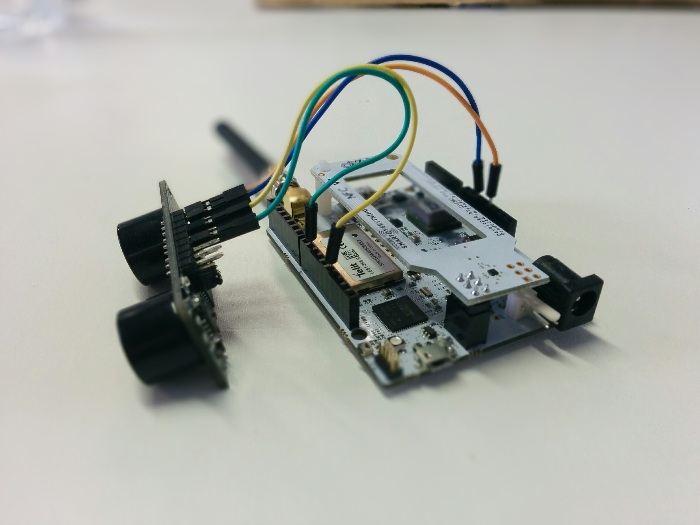
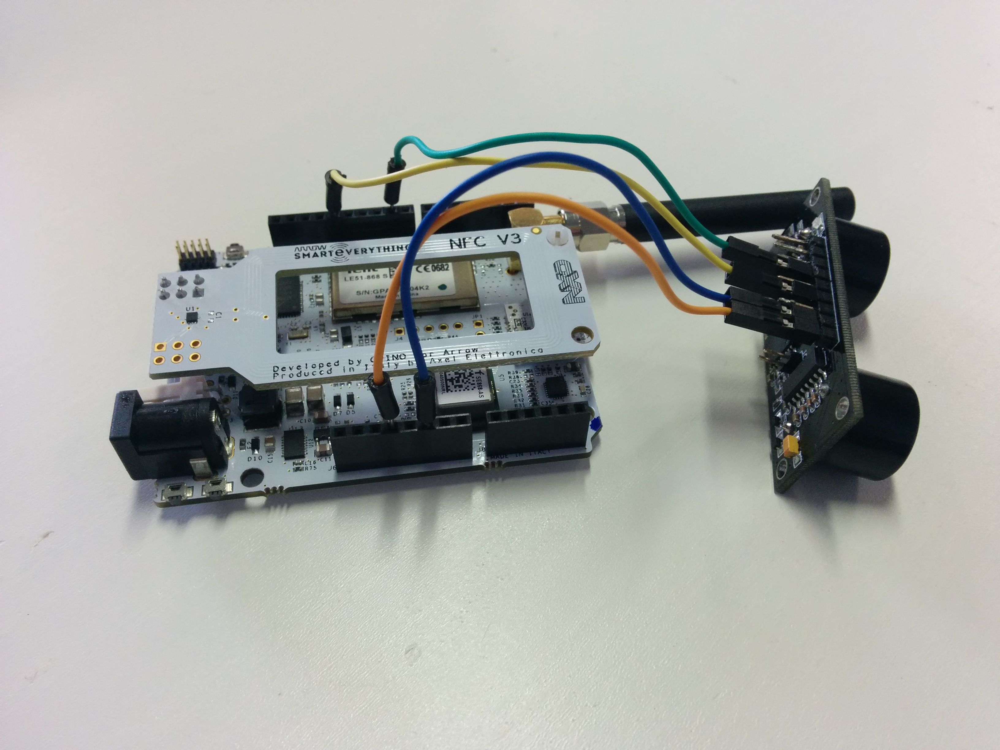

# SmartEverything-UltraSonic-Sensor-Sigfox
Code to use with the URM37 V3.2 Ultrasonic Sensor, using Sigfox on a SmartEverything board

# Presentation
For this code to work, you will need:
- 1x [SmartEverything board](http://www.smarteverything.it/)
- 1x [URM37 V3.2 sensor](http://www.dfrobot.com/wiki/index.php/URM37_V3.2_Ultrasonic_Sensor_%28SKU:SEN0001%29)
- 4x wires

Here's some pictures of my setup (click to see full res):




In this setup, the Blue wire is the **Ground** pin, the Orange wire is the **+5V** pin, the Yellow wire is the **PWM** pin, and the Green wire is the **Trig** pin.

**This script is using [this wrapping library](https://github.com/ameltech/sme-le51-868-library) to properly communicate with Sigfox.**

# Using the script
In Arduino, you need to choose the `"Smart Everything Fox (Native USB Port)"` board, if you don't have it, install it from `Tools > Board > Boards Manager` and type `SmartEverything Fox`.

Then change these two lines
```
int trig = 9;
int pwm = 13;
```
And replace `9` and `13` by the number of the pins you used in your setup.

When the script is running on your board, it should print (if there is an object 10 cm away of the sensor)
```
Distance: 10 cm
....... 
OK
```
The dots are printed while the message is being processed.
When `OK` is printed, your message has been sent to Sigfox, else `KO` will be printed.

The message sent is either `0` or `1`, as ASCII char, so 30 or 31 if converted to hex.
